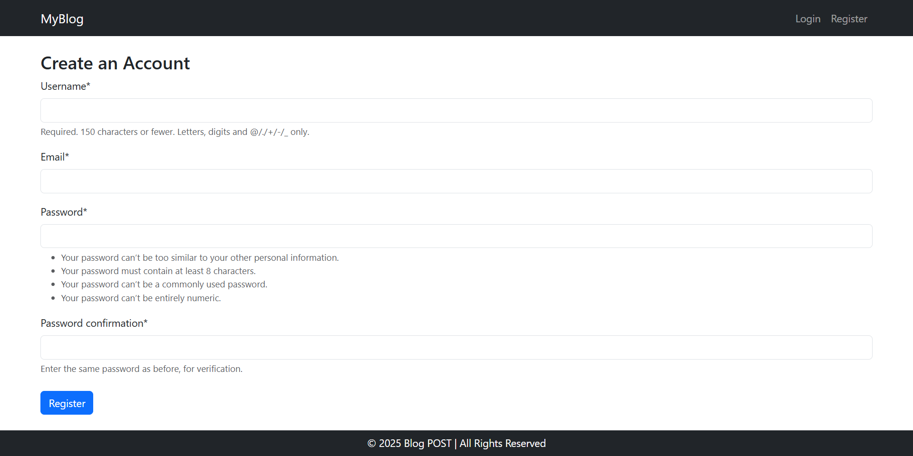
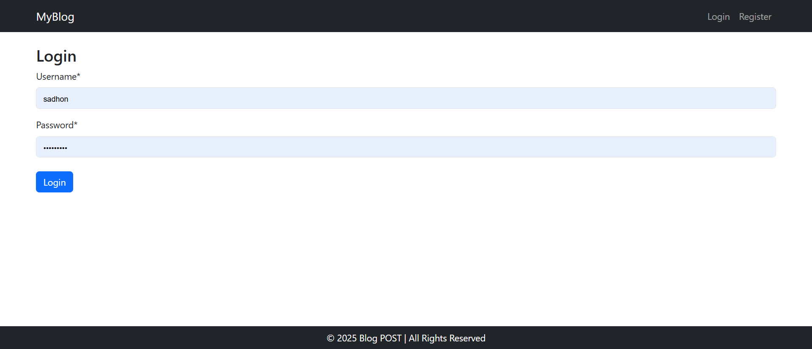
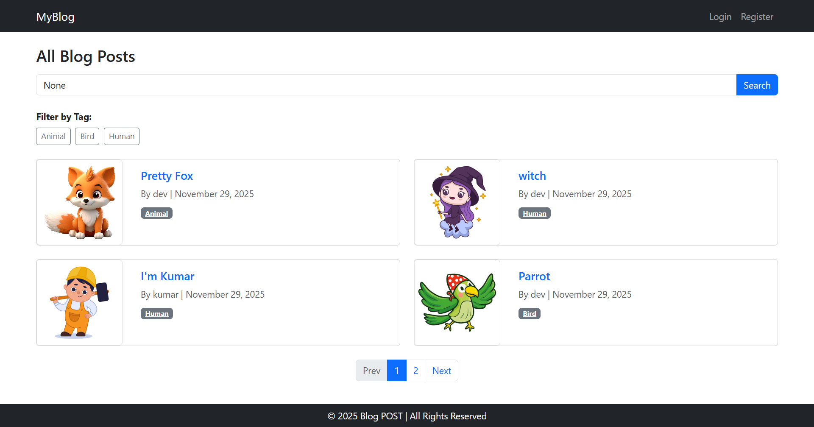
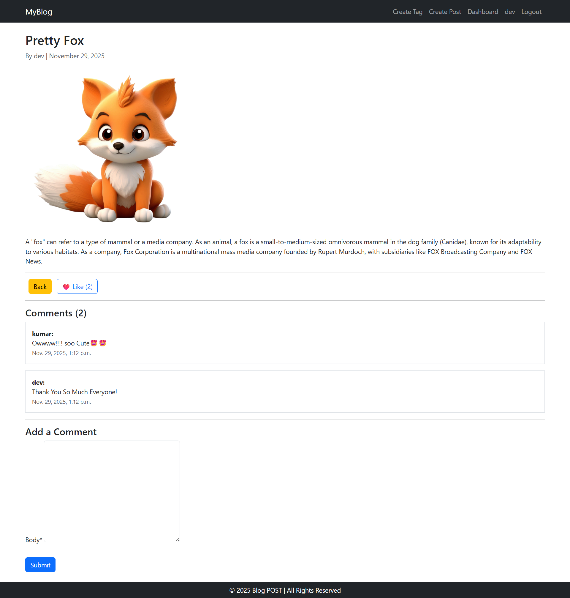
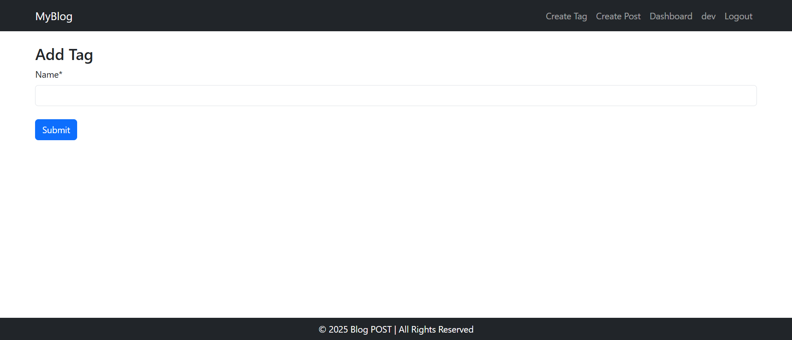
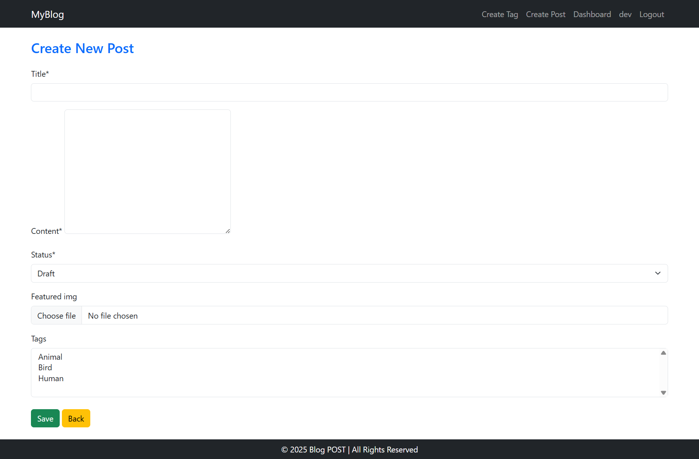
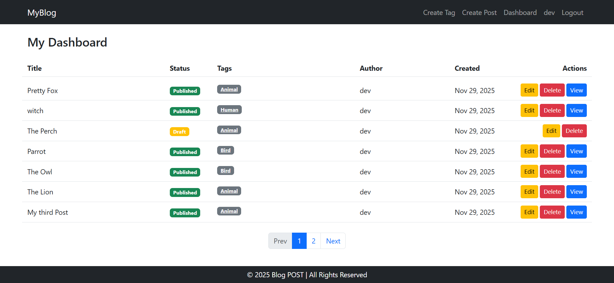

# Django Blog Application

## Overview
This is a fully functional Blog Application built with **Django 5.2.7** and **Python 3.13**.  
It demonstrates advanced CRUD operations, user interaction features, and best practices in Django development.  
Users can create, manage, and engage with blog posts in a secure and user-friendly interface.

## Features

### 1. Core Model & Content Management
- **Enhanced Post Model**:
  - `slug` field: Automatically generated from the title, unique for each post.
  - `status` field: Only 'Published' posts are visible publicly; Drafts remain private.
  - `featured_image` field: Supports image upload using Django's `ImageField`.
- **Search Functionality**: Full-text search on post titles and content.

### 2. User Interaction & Engagement
- **Commenting System**: Logged-in users can submit comments linked to posts.
- **Like/Reaction System**: Users can like posts; total likes are displayed.
- **Tags & Categorization**:
  - Many-to-many relationship for tags.
  - Dedicated view to list posts by tag.

### 3. Advanced Django Practices
- **Custom Dashboard**: Protected user-specific dashboard displaying all posts authored by the current user (including Drafts).
- **Authorization & Permissions**: Only the author of a post can edit or delete it, enforced via Django Mixins.
- **Pagination**: Main blog listing page supports pagination for better navigation.
- **Template Optimization**: Custom template tag implemented to display recent posts in the sidebar.

## Installation

1. **Clone the repository:**
   ```bash
   git clone <your-repo-url>
   cd <repository-folder>
   ```

2. **Create and activate a virtual environment:**
   ```bash
   python -m venv venv
   # Windows
   venv\Scripts\activate
   # macOS/Linux
   source venv/bin/activate
   ```

3. **Install dependencies:**
   ```bash
   pip install -r requirements.txt
   ```
   Ensure you have:
   - `Django==5.2.7`
   - `Pillow` (for image uploads)
   - Optional: `django-taggit` if using tags package

4. **Apply database migrations:**
   ```bash
   python manage.py migrate
   ```

5. **Create a superuser for admin access:**
   ```bash
   python manage.py createsuperuser
   ```

6. **Run the development server:**
   ```bash
   python manage.py runserver
   ```

7. **Access the application:**
   - Public Blog: `http://127.0.0.1:8000/`
   - Admin Panel: `http://127.0.0.1:8000/admin/`

---

## Screenshots








## Technologies Used
- Python 3.13
- Django 5.2.7
- Bootstrap 5
- Pillow (for image uploads)
- Optional: django-taggit for tags

## Notes
- Ensure `MEDIA_URL` and `MEDIA_ROOT` are configured for image uploads.
- Messages framework used for success and error notifications.
- User authentication is required for post creation, commenting, and liking.

---

This README is ready to use with Python 3.13 and Django 5.2.7.  

---

